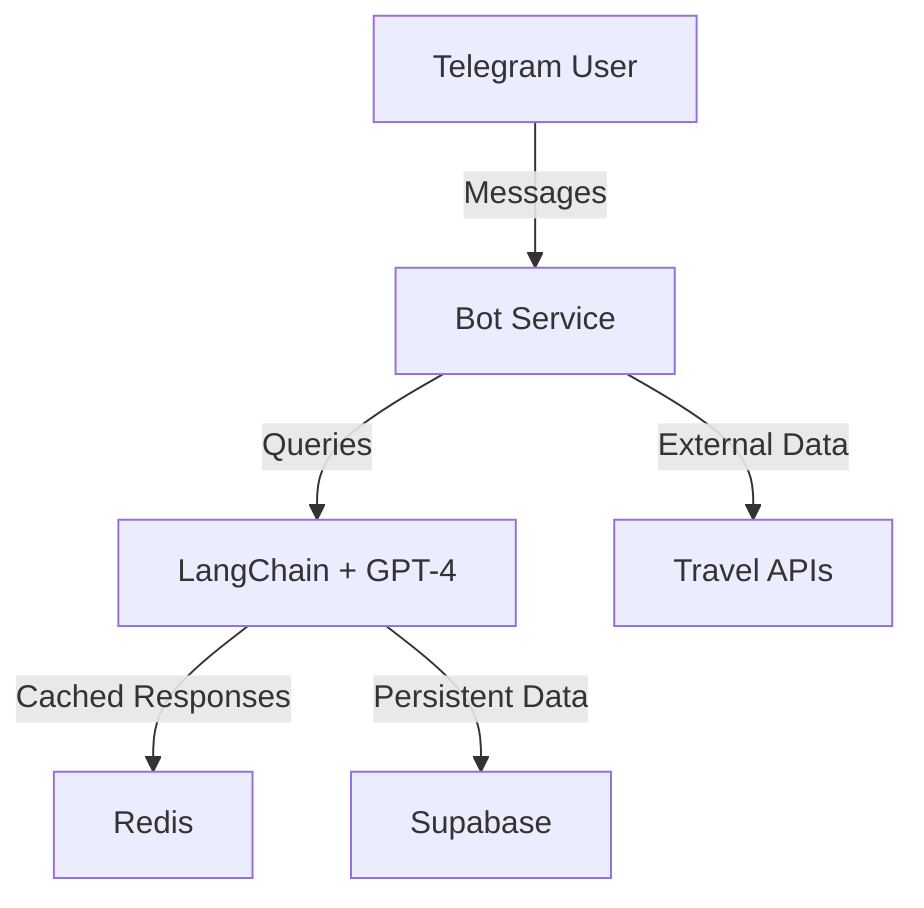

# Bali Travel Planner Bot 🌴

> An AI-powered Telegram bot that helps plan the perfect Bali vacation using LangChain and GPT-4. Get personalized recommendations for destinations, accommodations, and activities while staying within your budget.

[](https://github.com/esakrissa/telegram-langchain/actions/workflows/deploy.yml)
[](https://www.python.org/downloads/)
[](https://opensource.org/licenses/MIT)

## ✨ Features

- 🤖 **Smart Conversations**: Multi-turn dialogue with memory for natural interactions
- 🏨 **Real-time Data**: Live integration with flight, hotel, and weather APIs
- 🌍 **Language Support**: Automatic translation and cultural context
- 💰 **Budget Planning**: Smart cost analysis and alternative suggestions
- 📍 **Local Insights**: Curated recommendations for Bali's best experiences

## 🚀 Quick Start

### Prerequisites
- Python 3.10+
- Telegram Bot Token
- OpenAI API Key

### Setup
```bash
# Clone and install
git clone https://github.com/yourusername/telegram-langchain.git
cd telegram-langchain
pip install -r requirements.txt

# Configure environment
cp .env.example .env
# Edit .env with your API keys

# Run the bot
python bot.py
```

## 🏗 Architecture



### Tech Stack
- 🔄 **Runtime**: Python 3.10+, Docker
- 🧠 **AI/ML**: LangChain, OpenAI GPT-4
- 💾 **Storage**: Redis (Cache), Supabase (Database)
- ☁️ **Cloud**: GCP (e2-micro, Cloud Run)
- 🔄 **CI/CD**: GitHub Actions

## 🛠 Development

### Local Setup
```bash
docker-compose up -d
```

### Production Deployment
Automatically deployed to Google Cloud Run via GitHub Actions on main branch push.

## 📝 License

MIT © [Your Name]

---
Made with ❤️ for travelers 