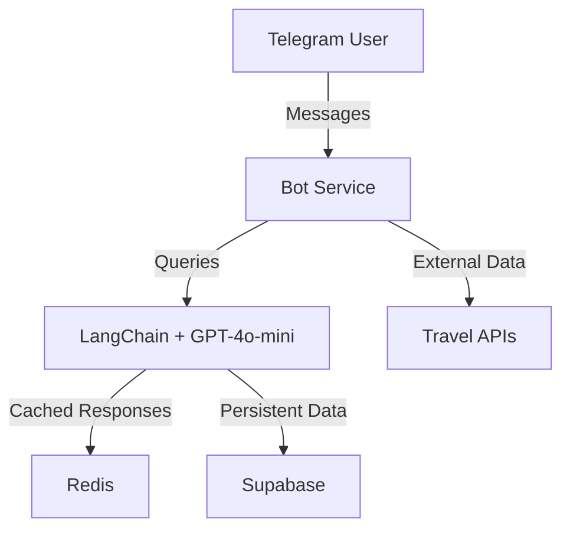

# Travel Agency Bot 🤖

> An intelligent Telegram bot powered by LangChain and GPT-4o-mini that helps plan personalized Bali vacations. From accommodation recommendations to cultural insights, make your Bali trip planning seamless and informed.

[](https://www.python.org/downloads/)
[](https://opensource.org/licenses/MIT)

## Overview 🎯

A smart travel assistant that combines AI capabilities with real-time travel data to provide:
- Natural conversation flow with context memory
- Real-time flight and hotel availability
- Multilingual support with cultural context
- Dynamic pricing and budget optimization
- Local insights and personalized recommendations

### Key Destinations
- **Ubud**: Cultural heart of Bali
- **Seminyak/Kuta**: Beach resorts and nightlife
- **Uluwatu**: Clifftop luxury and temples
- **Nusa Dua**: Family-friendly beaches
- **Canggu**: Digital nomad hub and surf spots

## Quick Start ⚡

### Prerequisites
```bash
- Python 3.10+
- Telegram Bot Token
- OpenAI API Key
```

### Installation
```bash
# Clone and install
git clone https://github.com/yourusername/telegram-langchain.git
cd telegram-langchain
pip install -r requirements.txt

# Configure environment
cp .env.example .env
# Edit .env with your API keys

# Start the bot
python bot.py
```

## Technical Architecture ⚙️

### Core Components


### Integrations
- **Flight Data**: Skyscanner API
- **Accommodations**: Booking.com API
- **Weather**: OpenWeatherMap API
- **Currency**: Exchange Rate API
- **Translation**: Google Cloud Translation

### Infrastructure
- **Runtime**: Python 3.10+, Docker
- **Database**: Supabase (PostgreSQL)
- **Caching**: Redis
- **Cloud**: Google Cloud Platform (e2-micro)
- **Deployment**: Cloud Run with auto-scaling

## Development 🚀

### Local Environment
```bash
# Start all services
docker-compose up -d

# View logs
docker-compose logs -f
```

### Production Deployment
The application automatically deploys to Google Cloud Run via GitHub Actions when changes are pushed to the main branch.

### Features in Development
- Intelligent budget optimization
- Cultural event recommendations
- Local transport integration
- Restaurant bookings
- Activity scheduling

## License

MIT © Travel Agency Bot

---
Built with LangChain and OpenAI for the modern traveler 